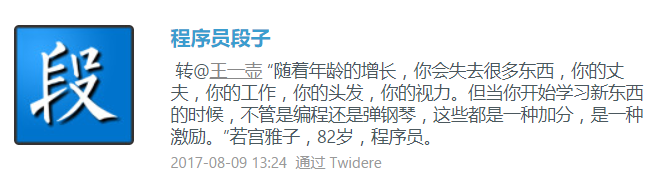

来写机器人呀
==============

大家好，我是小鲸鱼（ `@Mr.Greeting <https://fanfou.com/testbytse>`_ ）的作者（ `@home2 <https://fanfou.com/home2>`_ ），这是一个简短的教程，用来帮助你写自己的饭否机器人。

2016 年 7 月，有名饭友添加我的微信，发给我一个红包，附言说在 Github 上看了小鲸鱼的代码，交个学费。

2015 年的下半年，我开始有写一个写饭否机器人教程的想法，这名饭友的行为让我的想法更加明晰。无奈琐碎事多加上行动力不足，一直迟迟没有动手。
当我认真思考这件事的时候，我清楚我没有能力把 Python 讲得很明白（小鲸鱼用的是 Python），但可以采用边讲解边实践的方式，让大家快速上手写一个机器人。

当你准备往下阅读时，这里有两件事要告诉你：

- 无需担心，在开始之前你不用有编程的基础
- Python 很容易上手，我写小鲸鱼之前只看过《简明的 Python》

::
   
 “好像你是 xx 呀，怎么看起代码了”
 “人类的好奇心嘛”

这是我和那名饭友的两句对话，如果你刚好对此好奇并且有时间，那么让我们开始吧：

本教程循序渐进，只向你讲述后面你写机器人所需的基本知识（这也意味着会有不少知识点的遗漏），最后还附有实例，实属居家旅行 xxxxxx 。

如果你没有任何编程基础，请点击左侧导航栏按顺序学习，如果你已有 Python 基础，那么从 **访问饭否 API** 开始阅读即可。have fun ^_^

来源： `@程序员段子 <https://fanfou.com/statuses/j1xUNAwMqsQ>`_
