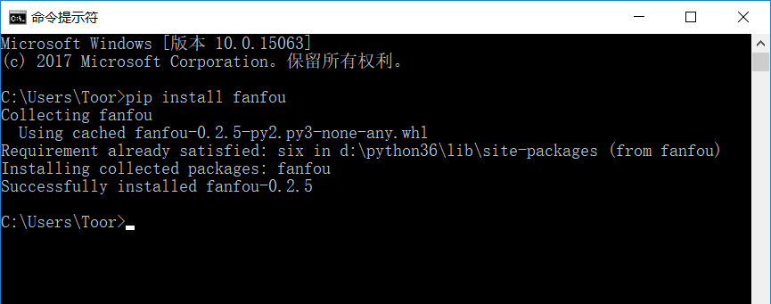
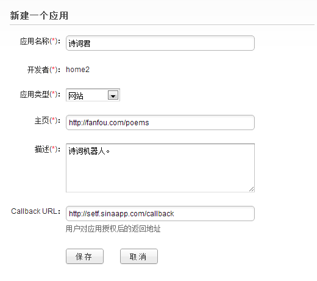

访问饭否 API
===============

Python 除了语法简单和功能强大外，还以它大量的优秀的库（包括标准库和第三方库）而闻名，不管你想做什么，你几乎都可以找到一个库拿来就用。

Python 中内置的标准库可以处理绝大部分的工作，但当标准库中没有现成的库，或用标准库来完成某项工作比较麻烦的时候，我们可以安装第三方库。

而我们访问饭否 API 就属于第二种情况，饭否 API 使用 OAuth（ `百度百科 OAuth <https://baike.baidu.com/item/oAuth>`_ ） 来认证，我们只想做个简单的机器人而已，
要去先理解 OAuth 的流程和手写认证流程可能略显麻烦（对于我们刚入门的新手来说哈），这个时候我们可以通过安装第三方库
`fanfou-py <https://github.com/akgnah/fanfou-py>`_ 来简化工作（懒也是天性嘛）。

安装第三方库
--------------

请使用管理员权限打开命令行提示符，输入 pip install fanfou 并按下回车，等待它自动下载并安装好。如果安装过程没有出错，你可能会看到下面的结果：

pip 是 Python 提供给我们安装第三库的工具，常用命令可输入 pip --help 查看。

我们来检验一下 fanfou-py 是否成功安装，请在命令行提示符中接着输入 python：

.. code-block:: python

   >>> import fanfou
   >>> fanfou.__version__
   0.2.5
   >>> 

如果你导入 fanfou 包没有出错，那么 pip 已经成功为我们安装了 fanfou-py。

如果安装过程因为网络原因出错，请尝试使用国内源重新安装：pip install fanfou -i https://pypi.douban.com/simple 。

我们顺便来安装一下 ipython 吧，这是一个比默认交互环境更友好的交互环境，请输入 pip install ipython 并按下回车，
安装完成后在命令行提示符下输入 ipython 即可启动 ipython，可随意玩一下喔。

饭否 API 简介
----------------

在我们写饭否应用的时候，我们每访问一个 API 的 URL，服务器都会相应作出响应，我们即可获取或提交一些数据。
服务器能返回 json、xml 和 rss 三种格式，json 可以很方便地转换成 Python 内置的对象，因此下面我们都会获取 json。

`JSON <http://www.json.org/json-zh.html>`_ 是一种轻量级的数据交换格式，
可以看看阮一峰老师的 `数据类型和 Json 格式 <http://www.ruanyifeng.com/blog/2009/05/data_types_and_json.html>`_ 以获取大体的印象。 

我们来看看几个常用的 API：

  - `/statuses/home_timeline.json <https://github.com/FanfouAPI/FanFouAPIDoc/wiki/statuses.home-timeline>`_    显示指定用户及其好友的消息
  - `/statuses/public_timeline.json <https://github.com/FanfouAPI/FanFouAPIDoc/wiki/statuses.public-timeline>`_    显示随便看看的消息
  - `/statuses/mentions.json <https://github.com/FanfouAPI/FanFouAPIDoc/wiki/statuses.mentions>`_    显示回复/提到当前用户的消息
  - `/statuses/update.json <https://github.com/FanfouAPI/FanFouAPIDoc/wiki/statuses.update>`_    发送消息
  - `/statuses/show.json <https://github.com/FanfouAPI/FanFouAPIDoc/wiki/statuses.show>`_    返回好友或未设置隐私用户的某条消息
  - `/users/show.json <https://github.com/FanfouAPI/FanFouAPIDoc/wiki/users.show>`_    返回好友或未设置隐私用户的信息

在访问饭否 API 之前，我们需要一个 Consumer，如果你没有，那么可以浏览 `饭否应用 <https://fanfou.com/apps>`_ 新建一个。

.. image:: image/apps.png

请复制你的 Consumer Key 和 Consumer Secret，下面我们会用到（刚才我们安装了 ipython，你也可以试试更友好的交互环境喔）：

.. code-block:: python

   >>> import fanfou
   >>> consumer = {'key': 'your consumer key', 'secret': 'your consumer secret'}    # 请注意，这里要替换成你的 key 和 secret
   >>> client = fanfou.XAuth(consumer, 'username', 'password')    # 请注意，这里要替换成你的 ID 和密码
   >>> fanfou.bound(client)
   >>> resp = client.statuses.home_timeline()    # 将会访问 http://api.fanfou.com/statuses/home_timeline.json
   >>> data = resp.json()
   >>> type(data)
   <class 'list'>
   >>> data[0]
   # something ... 
   >>> type(data[0])
   <class 'dict'>
   >>> data[0]['text']
   # something ...
   >>> 

你刚才完成了第一次访问饭否 API，并获取了一些首页的消息（上面的 data），使用内置函数 type() 查看它的类型，发现是列表。

那么我们可以通下标的方式去获取某一条消息，让我们输入 data[0] 看看，发现打印的东西的格式很熟悉，是我们接触过的字典，使用 type() 查看发现猜测正确。

我们通过 data[0]['text'] 得到了第一条消息的文本，现在打开饭否在首页找找看是否有一条消息内容和它相同。

fanfou-py 会为每个 API URL 提供对应的方法，我们只需要简单调用它即可，你能从上面的示例代码中看到 URL 和方法的对应关系吗？

访问其他 API 的方式也是这样，我们能在 `饭否官方的 API 文档 <https://github.com/FanfouAPI/FanFouAPIDoc/wiki/Apicategory>`_ 查看每个 API 可接受什么参数，
以及会返回什么结果，然后参照这些说明来完成我们想要做的工作。

让我们点开 `/statuses/home_timeline.json <https://github.com/FanfouAPI/FanFouAPIDoc/wiki/statuses.home-timeline>`_  看看，
主要应该关心的参数有 page、count 和 format，page 是想要获取第几页的消息，count 是每页消息多少条，format 是返回内容的格式，
如果是 'html' 那么返回消息中 @ 提到的用户和网址将输出 html 链接，让我们传递些参数再来获取一次 home_timeline ：

.. code-block:: python

   >>> body = {'page': 1, 'count': 10}
   >>> resp = client.statuses.home_timeline(body)
   >>> data = resp.json()
   >>> type(data)
   <class 'list'>
   >>> len(data)
   10
   >>> 
   
看来确实如我们期望般工作，在上面的代码中可以看到，把想要传递的参数放在一个字典中，并传递给对应 API 的函数，调用即可。

告诉你一个技巧，如果你使用 ipython 在输入这些代码，当你输入了一半字母，按 Tab 键即可补全，如输入了 client.stat 接着按 Tab，然后再输入 .home 再按 Tab，
Tab 补全能让你少按些键盘，还能避免手误输入错误。

让我们通过 API 来更新（update）一条饭吧：

.. code-block:: python

   >>> body = {'status': 'hello, fanfou'}
   >>> resp = client.statuses.update(body)
   >>> resp.code
   200
   >>> 
   
打开你的饭否去查看效果吧。

顺便说一下，resp 是一个 HttpRespone 实例，我们可通过内置函数 dir() 来查看它的全部属性。
常用的属性有 resp.code 和 resp.json()，前者用于查看刚才发送的请求是否成功，如果成功则值为 200，可点 `这里 <http://t.cn/RWz3kcC>`_ 查看全部的 HTTP Status Code 含义，
后者用于把 API 服务器返回的 json 转换成 Python 内置的对象。

还有剩下的几条 API 请点击上面的链接简单浏览一下。在上面的认证过程中，我们使用了较为简单的 XAuth 认证方式，如果 OAuth 认证方式感兴趣，
可以查看 `fanfou-py <https://github.com/akgnah/fanfou-py>`_ 的文档，文档中有详细的说明，还有收集有一些使用 fanfou-py 的应用作为 Demo。

