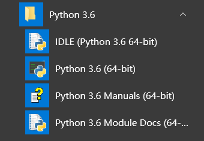
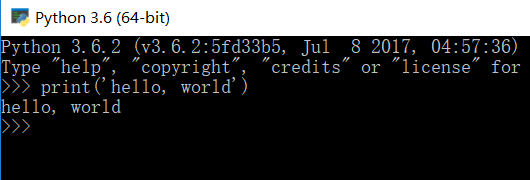
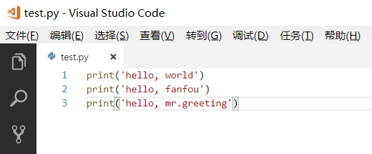
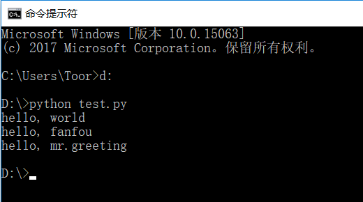

安装 Python
==============

Python 是一门简单与功能强大的编程语言，并且非常容易入门，你只需学习一两天甚至几小时，就可以用来做些有趣的事了，比如写个饭否机器人。
Python 有 2 和 3 两个主要的版本，在这个教程中我们使用 Python 3，在撰写这个页面时，最新版本是 3.6.2。

在 Windows 中安装
-------------------
访问 `Python 官网 <https://www.python.org/downloads/>`_ 并下载最新版本的 Python，安装过程中请务必确认你勾选了 Add Python 3.6 to PATH 选项。

在 Mac OS 下安装
------------------
同样可以访问  `Python 官网 <https://www.python.org/downloads/>`_ 并下载最新版本的 Python，或者通过命令 brew install python3 安装。

在 GNU/Linux 下安装
---------------------
你可以使用发行版的包管理器来安装 Python 3，如 sudo apt-get install python3，有些发行版本如 Archlinux 会默认安装 python 3。

Hello, Python
-----------------

在这个教程中使用 Windows 10 作示例操作，同时使用 命令行提示符 来指代 Windows 的 CMD 或 Mac OS / Linux 的终端（terminal），下文不再说明。

完成安装后，你会在开始菜单看到一个 Python 3.6 的文件夹，现在请点击其中的 Python 3.6 来开始写你的第一行代码，这是 Python 的交互环境。

在你启动后，你会看到在你能开始输入内容的地方出现了 **>>>** ，这个被称作 Python 解释器提示符。按照惯例，在屏幕打印 “hello, world” 是一个庄重的仪式。

请在 >>> 后输入 **print('hello, world')** 并按下回车键，你将会看到屏幕上打印出 hello, world 字样，细节我们稍后再作解释。

你刚刚运行了你的第一行代码，恭喜你成为了程序员（小心发际线，逃）。

如果你正在电脑上阅读这篇文章，建议你跟着输入代码并观察获得的结果。《笨办法学 Python》的作者在一次 `访谈 <https://hackbrightacademy.com/blog/zed-shaw-visits-hackbright-academy/>`_ 中说：
“学习编程语言的秘密？找本书，手工输入所有代码，并令其能工作。”

可能你还想打印其他的字样，比如 print('hello, fanfou') ，请随意修改单引号（'）里面的内容，并按下回车键。

当你想退出交互环境时，请输入 exit() 并按下回车键，或点右上角的关闭图标。

Python 可以交互地运行你输入的代码，但这并不是你写 Python 程序的唯一方式。当代码很长的时候，你可能不会喜欢每次都输入并按下回车等待运行的结果，这时候你需要用文件的形式组织代码。
现在你需要找一个你喜欢的文本编辑器（不要使用自带的记事本），如果不知道该选择什么，推荐微软家的 `VSCode <https://code.visualstudio.com/>`_。

打开编辑器，按下 Ctrl + N 新建一个文件，输入以下代码并保存为 test.py （假设你保存在 d 盘，如果文件没有显示拓展名，请浏览 `显示文件拓展名 <http://t.cn/ROBKWbl>`_）：

.. code-block:: python

   print('hello, world')
   print('hello, fanfou')
   print('hello, mr.greeting')

现在请在开始菜单中找到 命令行提示符 （或者按下 Win + r 键，输入 cmd 并回车），
输入 d: 并按下回车，接着输入 python test.py 并按下回车，你将会看到：

以上便是以文件形式运行 Python 的方法，在下文中如果你看到 **>>>** 提示符开头的代码，那么请在 Python 交互环境中输入并按下回车，当需要保存为文件的时候我会明确说明。

交互地运行你输入的代码，可以即时看到效果，是试错的很好方式，在下面挺长的篇幅中我会采用这种方式。

在学习下面内容之前，请确保你熟悉了上面的操作。另外当你在命令行提示符中输入 python 不跟着文件名，也会进入 Python 的交互环境，这和你在开始菜单点击 Python 3.6 是一样的。
