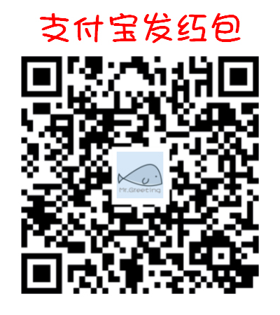

是结束更是开始
===============

我们的教程至此就要告一段落了，由于篇幅短小和时间仓促（最重要是由于我水平较差），这个教程中必有不少错漏，若你发现了错误请告知我。

希望我没有误导你，而是能带你看看小小的新世界。如果你了解多些 Python，有几本书我认为还不错的：

  - `《Python 简明教程》 <https://bop.molun.net/>`_
  - `《Python 语言及其应用》 <http://www.ituring.com.cn/book/1560>`_
  - `《Python 基础教程（第 2 版）》 <http://www.ituring.com.cn/book/159>`_

排名不分向后，你可以随意选择一本来看，如果还有其他我能帮助你的，请在饭否上联系我 `@home2 <https://fanfou.com/home2>`_ 。
同时也希望你能写出有趣的机器人，请一定要告诉我，我会很开心。

如果阅读过程你觉得愉快，可以请我喝杯咖啡：

::

   要是有所得罪请原谅。本是出自一番好意，只是想显点粗浅技艺，那才是我们的初衷。
           —— 威廉·莎士比亚，《仲夏夜之梦》（A Midsummer Night’s Dream）
				 
   （摘自《JavaScript 语言精粹》前言）
